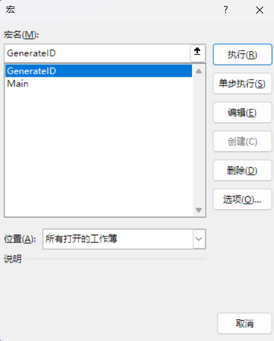

# Tutorial
# 💻环境
- Windows
    - Mindmap8 Update 9 Pro
    - Microsoft Excel

# 🚧快速上手
>以下教程使用到的文件在`example/`文件夹下

使用Mindmap编写测试用例（格式参考`template.xmind`模板)

在Xmindmap内导出Excel文件。表格布局选择”合并单元格“，中心主题位置选择”行1“。

*注：Pro版本Mindmap才能具有导出权限*

使用Microsoft Excel打开Excel文件

点击 “开发工具-Visual Basic”

右键项目，点击”导入文件“

点击 ”开发工具-宏“，此时出现`GenerateID`宏和`Main`宏

- GenerateID：对当前工作表自动生成并刷新测试用例ID，至少一次运行`Main`后使用。测试ID的格式是`gep_[系统名]_gn_[模块名]_id`
- Main：对工作簿下所有工作表生成剩余表头，并调整格式，调用`GenerateID`生成测试用例ID。

调用`Main`后的测试用例表格

